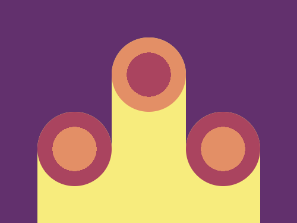
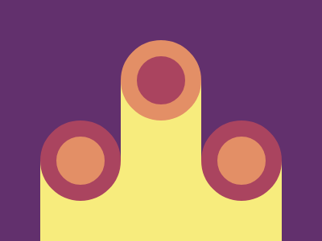

# #10. Cloaked Spirits

Challenge: <https://cssbattle.dev/play/10>

## Result

<table>
	<tr>
		<th width="50%">User Submission</th>
		<th width="50%">Target</th>
	</tr>
	<tr>
		<td width="50%" align="center">
			
		</td>
		<td width="50%" align="center">
			
		</td>
	</tr>
</table>

## Code

```html
<div class = "container">
  <div class = "circle-1 left"></div>
  <div class = "circle-1 right"></div>
  <div class = "circle-2 top"></div>
  <div class = "rect-1 left-1"></div>
  <div class = "rect-2"></div>
  <div class = "rect-1 right-1"></div>
</div>
<style>
  * {
    margin: 0;
    padding: 0;
  }
  .container {
    position: relative;
    width: 400px;
    height: 300px;
    background: #62306D;
  }
  .circle-1 {
    position: absolute;
    width: 100px;
    height: 100px;
    border-radius: 50%;
    background: radial-gradient(circle at center, #E38F66 0 42%, #AA445F 42% 100%);
    z-index: 1;
  }
  .left {
    position: absolute;
    left: 50px;
    bottom: 50px;
  }
  .right {
    position: absolute;
    right: 50px;
    bottom: 50px;
  }
  .circle-2 {
    position: absolute;
    width: 100px;
    height: 100px;
    border-radius: 50%;
    background: radial-gradient(circle at center, #AA445F 0 42%, #E38F66 42% 100%);
  }
  .top {
    position: absolute;
    top: 50px;
    left: 150px;
    z-index: 1;
  }
  .rect-1 {
    position: absolute;
    width: 100px;
    height: 150px;
    background: #F7EC7D;
    border-top-left-radius: 50px;
    border-top-right-radius: 50px;
  }
  .left-1 {
    position: absolute;
    left: 50px;
    bottom: 0;
  }
  .right-1 {
    position: absolute;
    right: 50px;
    bottom: 0;
  }
  .rect-2 {
    position: absolute;
    width: 100px;
    height: 300px;
    background: #F7EC7D;
    left: 150px;
    top: 50px;
    border-top-left-radius: 50px;
    border-top-right-radius: 50px;
  }
  
</style>
```
