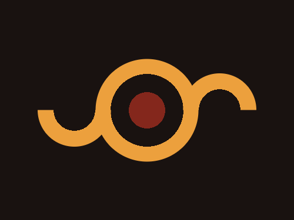

# #11. Eye of Sauron

Challenge: <https://cssbattle.dev/play/11>

## Result

<table>
	<tr>
		<th width="50%">User Submission</th>
		<th width="50%">Target</th>
	</tr>
	<tr>
		<td width="50%" align="center">
			
		</td>
		<td width="50%" align="center">
			
		</td>
	</tr>
</table>

## Code

```html
<div class = "container">
  <div class = "circle"></div>
  <div class = "small left"></div>
  <div class = "small right"></div>
</div>
<style>
  * {
    margin: 0;
    padding: 0;
  }
  .container {
    position: relative;
    width: 400px;
    height: 300px;
    background: #191210;
  }
  .circle {
    position: absolute;
    width: 140px;
    height: 140px;
    border-radius: 50%;
    top: 50%;
    left: 50%;
    transform: translate(-50%,-50%);
    background: radial-gradient(circle at center, #84271C 0 25%, #191210 25% 50%, #ECA03D 50% 100%);
  }
  .small {
    position: absolute;
    width: 100px;
    height: 100px;
    border-radius: 50%;
    background: radial-gradient(circle at center, #191210 0 40%, #ECA03D 40% 100%);
  }
  .left {
    position: absolute;
    top: 100px;
    left: 51px;
    clip-path: polygon(0% 50%,100% 50%,100% 100%,0% 100%);
  }
  .right {
    position: absolute;
    top: 100px;
    right: 51px;
    clip-path: polygon(0% 0%,100% 0%,100% 50%,0% 50%);
  }
  
</style>
```
