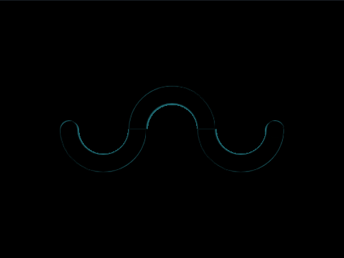

# #12. Wiggly Moustache

Challenge: <https://cssbattle.dev/play/12>

## Result

<table>
	<tr>
		<th width="50%">User Submission</th>
		<th width="50%">Target</th>
	</tr>
	<tr>
		<td width="50%" align="center">
			
		</td>
		<td width="50%" align="center">
			
		</td>
	</tr>
</table>

## Code

```html
<div class = "container">
  <div class = "circle left"></div>
  <div class = "circle center"></div>
  <div class = "circle right"></div>
  <div class = "left-cap"></div>
  <div class = "right-cap"></div>
</div>
<style>
  * {
    margin: 0;
    padding: 0;
  }
  .container {
    position: relative;
    width: 400px;
    height: 300px;
    background: #F5D6B4;
  }
  .circle {
    position: absolute;
    width: 100px;
    height: 100px;
    border-radius: 50%;
    background: radial-gradient(circle at center, #F5D6B4 0% 40%, #D86F45 40% 100%);
    top: 50%;
    transform: translateY(-50%);
  }
  .center {
    position: absolute;
    left: 150px;
    clip-path: polygon(0% 0%, 100% 0%, 100% 50%, 0% 50%);
  }
  .left {
    position: absolute;
    left: 70px;
    clip-path: polygon(0% 50%, 100% 50%, 100% 100%, 0% 100%);
  }
  .right {
    position: absolute;
    left: 230px;
    clip-path: polygon(0% 50%, 100% 50%, 100% 100%, 0% 100%);
  }
  .left-cap {
    position: absolute;
    width: 22px;
    height: 22px;
    border-radius: 50%;
    background: #D86F45;
    top: 47%;
    left: 70px;
  }
  .right-cap {
    position: absolute;
    width: 22px;
    height: 22px;
    border-radius: 50%;
    background: #D86F45;
    top: 47%;
    right: 70px;
  }
</style>
```
