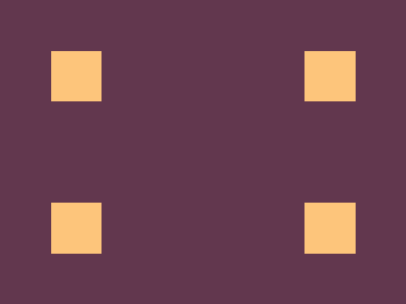

# #2. Carrom

Challenge: <https://cssbattle.dev/play/2>

## Result

<table>
	<tr>
		<th width="50%">User Submission</th>
		<th width="50%">Target</th>
	</tr>
	<tr>
		<td width="50%" align="center">
			
		</td>
		<td width="50%" align="center">
			
		</td>
	</tr>
</table>

## Code

```html
<div class = "container">
  <div class = "square top-left"></div>
  <div class = "square top-right"></div>
  <div class = "square bottom-left"></div>
  <div class = "square bottom-right"></div>
</div>
<style>
  * {
    margin: 0;
    padding: 0;
  }
  .container {
    position: relative;
    width: 400px;
    height: 300px;
    background: #62374e;
  }
  .square {
    position: absolute;
    width: 50px;
    height: 50px;
    background: #fdc57b;
  }
  .top-left {
    top: 50px;
    left: 50px;
  }
  .top-right {
    top: 50px;
    right: 50px;
  }
  .bottom-left {
    bottom: 50px;
    left: 50px;
  }
  .bottom-right {
    bottom: 50px;
    right: 50px;
  }
</style>
```
