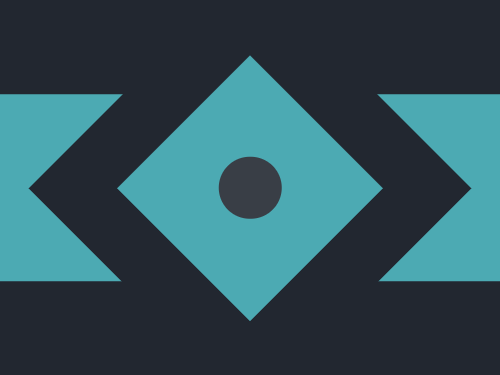

# #9. Tesseract

Challenge: <https://cssbattle.dev/play/9>

## Result

<table>
	<tr>
		<th width="50%">User Submission</th>
		<th width="50%">Target</th>
	</tr>
	<tr>
		<td width="50%" align="center">
			
		</td>
		<td width="50%" align="center">
			
		</td>
	</tr>
</table>

## Code

```html
<div class = "container">
  <div class = "rectangle"></div>
  <div class = "outer-square"></div>
  <div class = "inner-square"></div>
  <div class = "circle"></div>
</div>
<style>
  * {
    margin: 0;
    padding: 0;
  }
  .container {
    position: relative;
    width: 400px;
    height: 300px;
    background: #222730;
  }
  .rectangle {
    position: absolute;
    width: 400px;
    height:150px;
    background: #4CAAB3;
    top: 50%;
    left: 50%;
    transform: translate(-50%,-50%);
  }
  .outer-square {
    position: absolute;
    width: 250px;
    height:250px;
    background: #222730;
    top: 50%;
    left: 50%;
    transform: translate(-50%,-50%) rotate(45deg);
  }
  .inner-square {
    position: absolute;
    width: 150px;
    height:150px;
    background: #4CAAB3;
    top: 50%;
    left: 50%;
    transform: translate(-50%,-50%) rotate(45deg);
  }
  .circle {
    position: absolute;
    width: 50px;
    height: 50px;
    border-radius: 50%;
    background: #393E46;
    top: 50%;
    left: 50%;
    transform: translate(-50%,-50%);
  }
</style>
```
