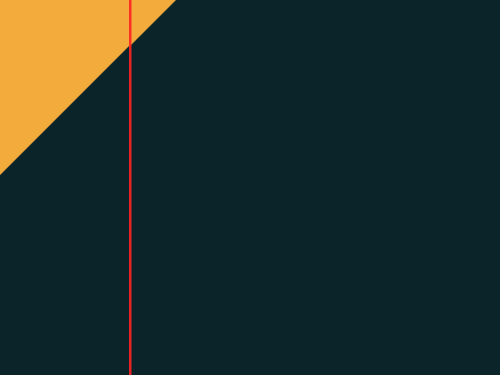

# #13. Totally Triangle

Challenge: <https://cssbattle.dev/play/13>

## Result

<table>
	<tr>
		<th width="50%">User Submission</th>
		<th width="50%">Target</th>
	</tr>
	<tr>
		<td width="50%" align="center">
			
		</td>
		<td width="50%" align="center">
			
		</td>
	</tr>
</table>

## Code

```html
<div class = "container">
  <div class = "triangle"></div>
</div>
<style>
  * {
    margin: 0;
    padding: 0;
  }
  .container {
    position: relative;
    width: 400px;
    height: 300px;
    background: #0B2429;
  }
  .triangle {
    position: absolute;
    width: 140px;
    height: 140px;
    background: #F3AC3C;
    clip-path: polygon(0% 0%, 0% 100%, 100% 0%);
  }
</style>
```
