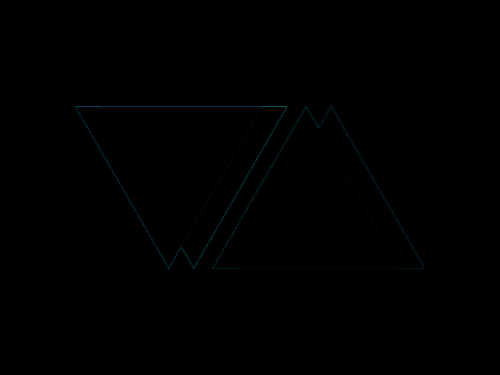

# #14. Web Maker Logo

Challenge: <https://cssbattle.dev/play/14>

## Result

<table>
	<tr>
		<th width="50%">User Submission</th>
		<th width="50%">Target</th>
	</tr>
	<tr>
		<td width="50%" align="center">
			
		</td>
		<td width="50%" align="center">
			
		</td>
	</tr>
</table>

## Code

```html
<div class = "container">
  <div class = "triangle-1"></div>
  <div class = "triangle-1 right"></div>
  <div class = "triangle-2"></div>
  <div class = "triangle-2 left"></div>
</div>
<style>
  * {
    margin: 0;
    padding: 0;
  }
  .container {
    position: relative;
    width: 400px;
    height: 300px;
    background: #F2F2B6;
  }
  .triangle-1 {
    position: absolute;
    width: 150px;
    height: 130px;
    background: #FF6D00;
    top: 50%;
    left: 60px;
    transform: translateY(-50%) scaleY(-1);
    clip-path: polygon(50% 0%, 100% 100%, 0% 100%);
    z-index: 2;
  }
  .right{
    left: 80px;
    background: #FD4602;
    z-index: 1;
  }
  .triangle-2 {
    position: absolute;
    width: 150px;
    height: 130px;
    background: #FF6D00;
    top: 50%;
    right: 60px;
    transform: translateY(-50%);
    clip-path: polygon(50% 0%, 100% 100%, 0% 100%);
    z-index: 2;
  }
  .left {
    right: 80px;
    background: #FD4602;
    z-index: 3;
  }
</style>
```
