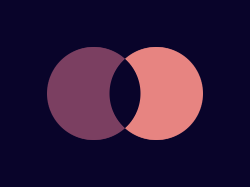

# #15. Overlap

Challenge: <https://cssbattle.dev/play/15>

## Result

<table>
	<tr>
		<th width="50%">User Submission</th>
		<th width="50%">Target</th>
	</tr>
	<tr>
		<td width="50%" align="center">
			
		</td>
		<td width="50%" align="center">
			
		</td>
	</tr>
</table>

## Code

```html
<div class = "container">
  <div class = "circle left"></div>
  <div class = "circle right"></div>
</div>
<style>
  * {
    margin: 0;
    padding: 0;
  }
  .container {
    position: relative;
    width: 400px;
    height: 300px;
    background: #09042A;
  }
  .circle {
    position: absolute;
    width: 150px;
    height: 150px;
    border-radius: 50%;
  }
  .left {
    top: 75px;
    left: 75px;
    box-shadow: inset 100px 0px 0px 0px #7B3F61;
  }
  .right {
    top: 75px;
    right: 75px;
    box-shadow: inset -100px 0px 0px 0px #E78481;
  }
</style>
```
