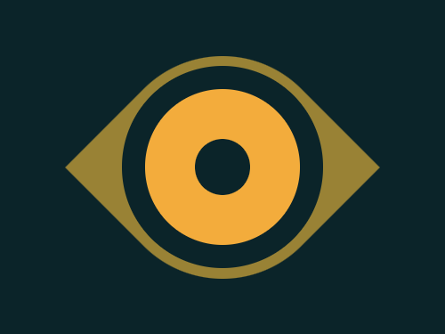
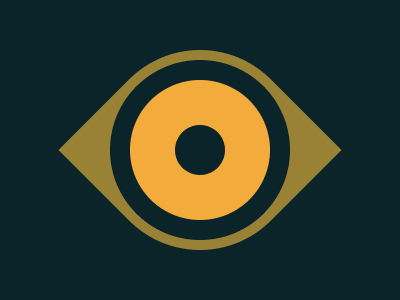

# #16. Eye of the Tiger

Challenge: <https://cssbattle.dev/play/16>

## Result

<table>
	<tr>
		<th width="50%">User Submission</th>
		<th width="50%">Target</th>
	</tr>
	<tr>
		<td width="50%" align="center">
			
		</td>
		<td width="50%" align="center">
			
		</td>
	</tr>
</table>

## Code

```html
<div class = "container">
  <div class = "inner-circle"></div>
  <div class = "outer-circle"></div>
  <div class = "eye"></div>
</div>
<style>
  * {
    margin: 0;
    padding: 0;
  }
  .container {
    width: 400px;
    height: 300px;
    background: #0B2429;
    display: flex;
    justify-content: center;
    align-items: center;
    position: relative;
  }
  .outer-circle {
    position: absolute;
    width: 50px;
    height: 50px;
    border: 45px solid #F3AC3C;
    border-radius: 50%;
    z-index: 2;
  }
  .inner-circle {
    position: absolute;
    width: 50px;
    height: 50px;
    border: 66px solid #0B2429;
    border-radius: 50%;
    z-index: 1;
  }
  .inner-circle::before {
    content: '';
    position: absolute;
    width: 50px;
    height: 50px;
    border-radius: 50%;
    background: #0B2429;
  }
  .eye {
    position: absolute;
    width: 200px;
    height: 200px;
    background: #998235;
    border-top-left-radius: 100px;
    border-bottom-right-radius: 100px;
    transform: rotate(45deg); 
  }
</style>
```
