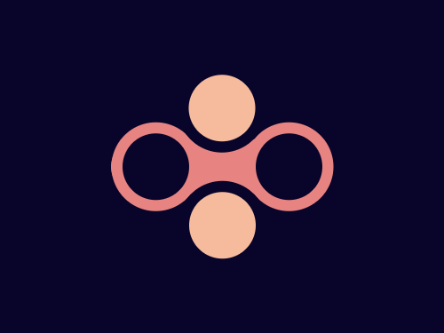

# #17. Fidget Spinner

Challenge: <https://cssbattle.dev/play/17>

## Result

<table>
	<tr>
		<th width="50%">User Submission</th>
		<th width="50%">Target</th>
	</tr>
	<tr>
		<td width="50%" align="center">
			
		</td>
		<td width="50%" align="center">
			
		</td>
	</tr>
</table>

## Code

```html
<div class = "container">
  <div class = "square"></div>
  <div class = "circle"></div>
</div>
<style>
  * {
    margin: 0;
    padding: 0;
  }
  .container {
    width: 400px;
    height: 300px;
    background: #09042A;
    position: relative;
  }
  .square {
    position: absolute;
    width: 200px;
    height: 50px;
    background: #E78481;
    left: 50%;
    top: 50%;
    transform: translate(-50%,-50%);
    border-radius: 40px;
  }
  .square::before {
    content: '';
    position: absolute;
    width: 60px;
    height: 60px;
    border-radius: 50%;
    background: #09042A;
    top: 50%;
    left: 5%;
    transform: translateY(-50%);
    box-shadow: 0px 0px 0px 10px #E78481;
  }
  .square::after {
    content: '';
    position: absolute;
    width: 60px;
    height: 60px;
    border-radius: 50%;
    background: #09042A;
    top: 50%;
    right: 5%;
    transform: translateY(-50%);
    box-shadow: 0px 0px 0px 10px #E78481;
  }
  .circle {
    position: absolute;
    width: 60px;
    height: 60px;
    border-radius: 50%;
    background: #F5BB9C;
    top: 50%;
    left: 50%;
    transform: translate(-50%,-83px);
    box-shadow: 0px 0px 0px 10px #09042A;
  }
  .circle::after {
    content: '';
    position: absolute;
    width: 60px;
    height: 60px;
    border-radius: 50%;
    background: #F5BB9C;
    top: 50%;
    left: 50%;
    transform: translate(-50%,76px);
    box-shadow: 0px 0px 0px 10px #09042A;
  }
</style>
```
