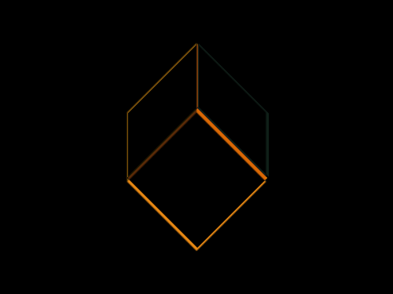

# #19. Cube

Challenge: <https://cssbattle.dev/battle/3>

## Result

<table>
	<tr>
		<th width="50%">User Submission</th>
		<th width="50%">Target</th>
	</tr>
	<tr>
		<td width="50%" align="center">
			
		</td>
		<td width="50%" align="center">
			
		</td>
	</tr>
</table>

## Code

```html
<div class = "container">
  <div class = "square"></div>
  <div class = "square-skew-1"></div>
  <div class = "square-skew-2"></div>
</div>
<style>
  * {
    margin: 0;
    padding: 0;
  }
  .container {
    position: relative;
    display: flex;
    justify-content: center;
    align-items: center;
    width: 400px;
    height: 300px;
    background: #0B2429;
  }
  .square {
    position: absolute;
    width: 101px;
    height: 101px;
    background: #F3AC3C;
    transform: rotate(45deg);
    top: 131px;
    left: 150px;
  }
  .square-skew-1 {
    position: absolute;
    width: 71px;
    height: 65px;
    background: #998235;
    transform: skew(0deg,-45deg);
    left: 130px;
    top: 80px;
  }
  .square-skew-2 {
    content: '';
    position: absolute;
    width: 71px;
    height: 65px;
    background: #1A4341;
    transform: skew(0deg,45deg);
    right: 127px;
    top: 80px;
  }
</style>
```
