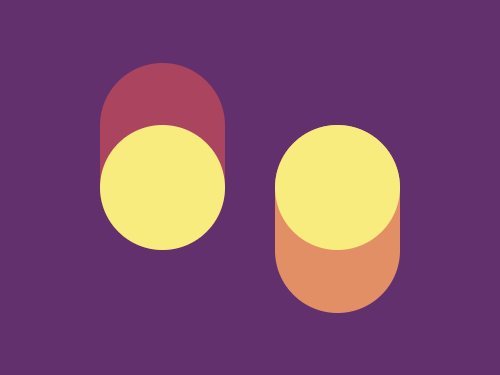

# #24. Switches

Challenge: <https://cssbattle.dev/battle/4>

## Result

<table>
	<tr>
		<th width="50%">User Submission</th>
		<th width="50%">Target</th>
	</tr>
	<tr>
		<td width="50%" align="center">
			
		</td>
		<td width="50%" align="center">
			
		</td>
	</tr>
</table>

## Code

```html
<div class = "container">
  <div class = "outer-1">
    <div class = "inner-1"></div>
  </div>
  <div class = "outer-2">
    <div class = "inner-2"></div>
  </div>
</div>
<style>
  * {
    margin: 0;
    padding: 0;
  }
  .container {
    position: relative;
    width: 400px;
    height: 300px;
    background: #62306D;
  }
  .outer-1 {
    position: relative;
    width: 100px;
    height: 150px;
    border-radius: 100px;
    background: #AA445F;
    left: 80px;
    top: 50px;
  }
  .inner-1 {
    position: absolute;
    width: 100px;
    height: 100px;
    border-radius: 50%;
    background: #F7EC7D;
    bottom: 0; 
  }
  .outer-2 {
    position: relative;
    width: 100px;
    height: 150px;
    border-radius: 100px;
    background: #E38F66;
    left: 220px;
    bottom: 50px;
  }
  .inner-2 {
    position: absolute;
    width: 100px;
    height: 100px;
    border-radius: 50%;
    background: #F7EC7D;
    top: 0; 
  }
</style>
```
