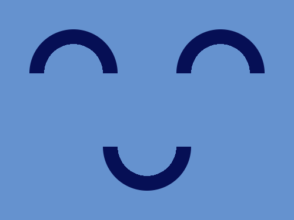
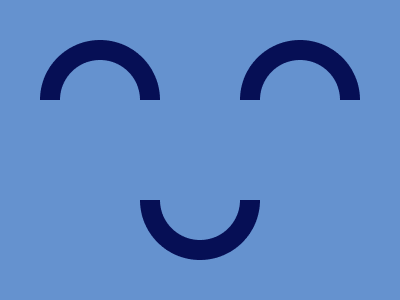

# #26. Smiley

Challenge: <https://cssbattle.dev/play/26>

## Result

<table>
	<tr>
		<th width="50%">User Submission</th>
		<th width="50%">Target</th>
	</tr>
	<tr>
		<td width="50%" align="center">
			
		</td>
		<td width="50%" align="center">
			
		</td>
	</tr>
</table>

## Code

```html
<div class = "container">
  <div class = "circle one"></div>
  <div class = "circle two"></div>
  <div class = "circle three"></div>
</div>
<style>
  * {
    margin: 0;
    padding: 0;
  }
  .container {
    position: relative;
    width: 400px;
    height: 300px;
    background: #6592CF;
  }
  .circle {
    position: absolute;
    width: 120px;
    height: 120px;
    border-radius: 50%;
    background: radial-gradient(circle at center, #6592CF 0% 47%, #060F55 47% 100%);
  }
  .one {
    position: absolute;
    left: 40px;
    top: 40px;
    clip-path: polygon(0% 0%,100% 0%,100% 50%,0% 50%);
  }
  .two {
    position: absolute;
    right: 40px;
    top: 40px;
    clip-path: polygon(0% 0%,100% 0%,100% 50%,0% 50%);
  }
  .three {
    position: absolute;
    right: 140px;
    bottom: 40px;
    clip-path: polygon(0% 100%,100% 100%,100% 50%,0% 50%);
  }
</style>
```
