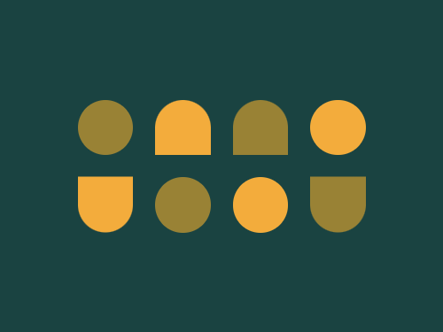

# #28. Cups & Balls

Challenge: <https://cssbattle.dev/play/28>

## Result

<table>
	<tr>
		<th width="50%">User Submission</th>
		<th width="50%">Target</th>
	</tr>
	<tr>
		<td width="50%" align="center">
			
		</td>
		<td width="50%" align="center">
			
		</td>
	</tr>
</table>

## Code

```html
<div class = "container">
  <div class = "rect">
    <div class = "shape-1"></div>
    <div class = "shape-2"></div>
    <div class = "shape-2 color-1 "></div>
    <div class = "shape-1 color-2"></div>
    <div class = "shape-2 flip-1"></div>
    <div class = "shape-1"></div>
    <div class = "shape-1 color-2"></div>
    <div class = "shape-2 flip-3"></div>
</div>
<style>
  * {
    margin: 0;
    padding: 0;
  }
  .container {
    width: 400px;
    height: 300px;
    background: #1A4341;
    display: flex;
    justify-content: center;
    align-items: center;
  }
  .rect {
    display: grid;
    grid-template-columns: repeat(4,1fr);
    gap: 20px;
  }
  .shape-1 {
    width: 50px;
    height: 50px;
    border-radius: 50%;
    background: #998235;
  }
  .shape-2 {
    width: 50px;
    height: 50px;
    border-top-left-radius: 30px;
    border-top-right-radius: 30px;
    background: #F3AC3C;
  }
  .color-1 {
    background: #998235;
  }
  .flip-1 {
    transform: scaleY(-1);
  }
  .color-2 {
    background: #F3AC3C;
  }
  .flip-3 {
    transform: scaleY(-1);
    background: #998235;
  }
</style>
```
