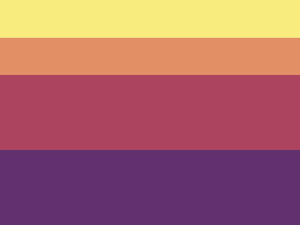
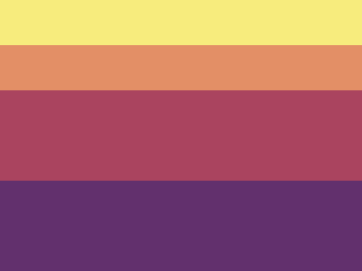

# #30. Horizon

Challenge: <https://cssbattle.dev/battles>

## Result

<table>
	<tr>
		<th width="50%">User Submission</th>
		<th width="50%">Target</th>
	</tr>
	<tr>
		<td width="50%" align="center">
			
		</td>
		<td width="50%" align="center">
			
		</td>
	</tr>
</table>

## Code

```html
<div class = "color-1"></div>
<div class = "color-2"></div>
<div class = "color-3"></div>
<div class = "color-4"></div>
<style>
  * {
    margin: 0;
    padding: 0;
  }
  .color-1 {
    height: 50px;
    background: #F7EC7D;
  }
  .color-2 {
    height: 50px;
    background: #E38F66;
  }
  .color-3 {
    height: 100px;
    background: #AA445F;
  }
  .color-4 {
    height: 100px;
    background: #62306D;
  }
</style>
```
