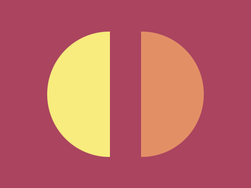

# #31. Equals

Challenge: <https://cssbattle.dev/play/31>

## Result

<table>
	<tr>
		<th width="50%">User Submission</th>
		<th width="50%">Target</th>
	</tr>
	<tr>
		<td width="50%" align="center">
			
		</td>
		<td width="50%" align="center">
			
		</td>
	</tr>
</table>

## Code

```html
<div class = "container">
  <div class = "semi-1"></div>
  <div class = "semi-2"></div>
</div>
<style>
  * {
    margin: 0;
    padding: 0;
  }
  .container {
    width: 400px;
    height: 300px;
    background: #AA445F;
    position: relative;
  }
  .semi-1 {
    position: absolute;
    width: 100px;
    height: 200px;
    background: #F7EC7D;
    border-top-left-radius: 100px;
    border-bottom-left-radius: 100px;
    top: 50px;
    left: 75px;
  }
  .semi-2 {
    position: absolute;
    width: 100px;
    height: 200px;
    background: #E38F66;
    border-top-right-radius: 100px;
    border-bottom-right-radius: 100px;
    top: 50px;
    right: 75px;
  }
</style>
```
