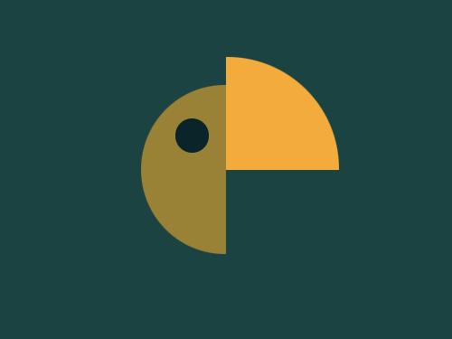
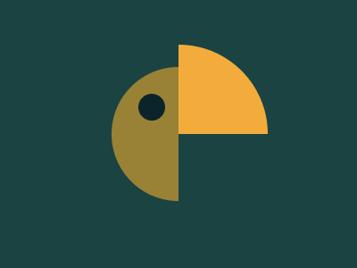

# #33. Birdie

Challenge: <https://cssbattle.dev/battle/7>

## Result

<table>
	<tr>
		<th width="50%">User Submission</th>
		<th width="50%">Target</th>
	</tr>
	<tr>
		<td width="50%" align="center">
			
		</td>
		<td width="50%" align="center">
			
		</td>
	</tr>
</table>

## Code

```html
<div class = "container">
  <div class = "left">
    <div class = "circle"></div>
  </div>
  <div class = "right"></div>
</div>
<style>
  * {
    margin: 0;
    padding: 0;
  }
  .container {
    position: relative;
    width: 400px;
    height: 300px;
    background: #1A4341;
  }
  .left {
    position: relative;
    width: 75px;
    height: 150px;
    background: #998235;
    border-top-left-radius: 100px;
    border-bottom-left-radius: 100px;
    top: 75px;
    left: 125px;
  }
  .circle {
    position: absolute;
    width: 30px;
    height: 30px;
    border-radius: 50%;
    background: #0B2429;
    top: 30px;
    left: 30px;
  }
  .right {
    position: relative;
    width: 100px;
    height: 100px;
    border-top-right-radius: 100px;
    background: #F3AC3C;
    left: 200px;
    bottom: 100px;
  }
</style>
```
